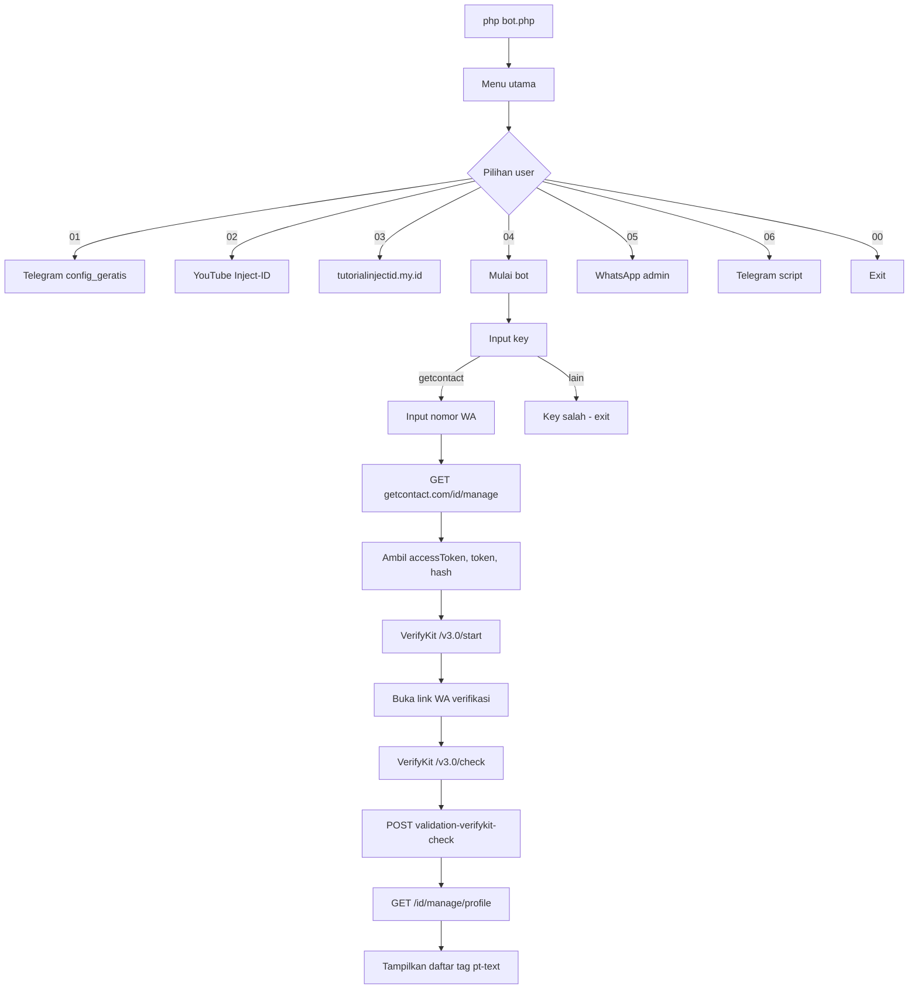

# Analisis bot.php — GetContact Cek

> Repo: [rusmanaid/getcontact](https://github.com/rusmanaid/getcontact)  
> Tanggal analisis: 2026-06-19 07:42 UTC  
> Tool: `decode_bot.py` (Python 3)

---

## 1. Ringkasan

`bot.php` adalah **bot CLI PHP** untuk mengecek **tag/nama yang disimpan pengguna GetContact** pada nomor WhatsApp tertentu. Kode asli disembunyikan dengan obfuscation berlapis dan enkripsi yang didekripsi lewat API pihak ketiga sebelum dijalankan dengan `eval()`.

| Item | Nilai |
|------|-------|
| Ukuran file asli | 77,210 byte |
| Ukuran kode setelah dekripsi | 10,842 karakter |
| Bahasa | PHP (CLI) |
| Author (dalam kode) | Rusmana-ID / Inject-ID |

---

## 2. Lapisan obfuscation

### Lapisan 1 — Hex escape string

Semua string penting ditulis sebagai `\x4f\x70...` agar tidak terbaca langsung.

**Contoh:** `\x68\x74\x74\x70` → `http`

### Lapisan 2 — Noise code

Variabel dan fungsi dengan nama acak (`_vcgehlul`, `_dnmxhumc`, `_jgdrplxm`, dll.) yang tidak mempengaruhi logika utama — hanya mengacau pembaca.

| Fungsi | Peran sebenarnya |
|--------|------------------|
| `_vcgehlul($a, $b)` | Menggabungkan dua string (`$a . $b`) |
| `_jgdrplxm($x)` | Mengecek field `code` tidak kosong |
| `_dnmxhumc($payload)` | POST JSON ke API dekripsi, return `code` |

### Lapisan 3 — Enkripsi + remote decrypt + eval

```
bot.php
  └─ susun payload (scriptId, data, iv, mac)
  └─ POST → https://php-encryptor.vercel.app/api/run
  └─ eval(kode_php_dari_response)
```

**Parameter enkripsi yang diekstrak:**

| Field | Nilai |
|-------|-------|
| `scriptId` | `3a83c2af4875e6da00d2cd7bbaac0b47` |
| `iv` | `b0626b462ac26c0d4d23adb68cbc3546` |
| `mac` | `0688539cd67b07a612377d9933c5fd312bf82e3d07a42567ce8aaa426c1bbe45` |
| `data` | 18,200 karakter (base64 terenkripsi) |

Komentar base64 di baris 35: `M2E4M2MyYWY0ODc1ZTZkYTAwZDJjZDdiYmFhYzBiNDc=` → decode hex dari scriptId.

---

## 3. Alur program (setelah dekripsi)



---

## 4. Endpoint & layanan eksternal

| URL | Metode | Fungsi |
|-----|--------|--------|
| `https://php-encryptor.vercel.app/api/run` | POST | Dekripsi kode PHP tersembunyi |
| `https://getcontact.com/id/manage` | GET | Ambil cookie/token sesi |
| `https://widget.verifykit.com/v3.0/start` | POST | Mulai verifikasi WhatsApp |
| `https://widget.verifykit.com/v3.0/check` | POST | Cek status verifikasi |
| `https://getcontact.com/validation-verifykit-check` | POST | Validasi session ke GetContact |
| `https://getcontact.com/id/manage/profile` | GET | Scrape daftar tag yang menyimpan nomor |

**Link promosi dalam menu:**

- Telegram: `https://t.me/config_geratis`
- YouTube: `https://youtube.com/@Inject1D`
- Web: `https://tutorialinjectid.my.id`
- Admin WA: `https://wa.me/6283879017166`
- Key (palsu/marketing): `bit.ly/getcontact-key`

---

## 5. Autentikasi & validasi

### Key akses

- Key hardcoded: **`getcontact`**
- Jika salah, user diarahkan ke `bit.ly/getcontact-key` (link marketing)

### Validasi nomor

- Nomor harus mengandung angka **`0`** (format lokal Indonesia)
- VerifyKit memvalidasi nomor via WhatsApp (kirim pesan verifikasi)

### Data yang diambil dari HTML

```php
$aks  = accessToken   // dari cookie response
$tkn  = token         // dari URL/widget
$hash = hash          // dari JSON di halaman
```

Hasil akhir: parse elemen `<div class="pt-text">...</div>` untuk setiap tag/nama.

---

## 6. Risiko keamanan

| Risiko | Keterangan |
|--------|------------|
| **Remote code execution** | `eval()` pada kode dari server eksternal — server bisa mengubah perilaku kapan saja |
| **SSL verify disabled** | `CURLOPT_SSL_VERIFYPEER = 0` — rentan MITM |
| **Scraping tanpa izin** | Melanggar ToS GetContact |
| **Data pribadi** | Menampilkan tag yang diberikan orang lain pada nomor |

---

## 7. Struktur folder hasil

```
decoder/
├── bahan/
│   └── bot.php                  ← file terenkripsi (input)
├── script/
│   └── decode_bot.py            ← tool decoder
└── output/
    ├── ANALISIS.md              ← dokumen ini
    ├── bot_decoded.php          ← kode mentah hasil dekripsi API
    ├── bot_deobfuscated_strings.php
    ├── decrypt_payload.json
    ├── decrypt_payload_full.json
    ├── comment_decoded.txt
    └── clean/
        ├── bot.php              ← kode dekripsi, dirapikan
        └── bot_obfuscated.php

getcontact/
└── script/
    └── bot.php                  ← salinan clean, siap dijalankan
```

---

## 8. Cara decode ulang

```bash
python decoder/script/decode_bot.py
```

---

## 9. Kesimpulan

Script ini **bukan API resmi GetContact**. Ia mengotomasi alur web manage profile GetContact dengan verifikasi WhatsApp (VerifyKit), lalu men-scrape HTML untuk menampilkan tag. Kode sengaja dienkripsi dan di-`eval` agar sulit diaudit; dependensi ke `php-encryptor.vercel.app` menambah risiko karena eksekusi kode dikontrol server pihak ketiga.
